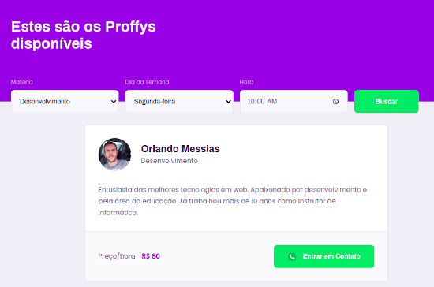
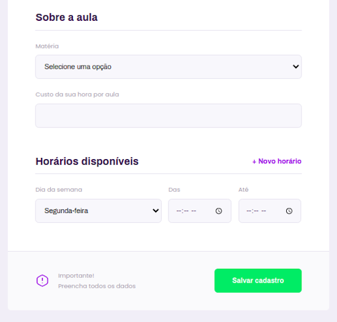

<p align="center">
  
</p>
<p align="center">
  
</p>

## Plataforma de Estudos Online

#### :computer: Projeto com NodeJS, Express, Typescript  :computer:

Proffy é uma plataforma de estudos online que conecta estudantes a professores de acordo com suas disponibilidades. Foi desenvolvida durante o evento **NLW (Next Level Week)**, uma experiência online para evoluir suas habilidades em programação e te elevar para o próximo nível.

:camera: **Screenshots de telas**

- :mag: *Pesquisar por Professor*
<p align="center"></p>

- :heavy_plus_sign: *Cadastrar nova Aula*
<p align="center"></p>

:hammer_and_wrench: **Tencologias utilizadas:**
- React
- Nodejs
- Typescript
- Express
- SQLite
- Knex.js

```
## Clone o repositório usando git
git clone https://github.com/orlando-messias/plataforma-estudos-online.git

## Na raiz do projeto, instale as dependências frontend
yarn install ou npm install

## Inicialize a aplicação
yarn start ou npm start

## Abra a pasta server, instale as dependências backend
cd server
yarn install ou npm install

## Rode o knew para criar as tabelas no banco de dados
yarn knex:migrate

## Inicialize o node
npm start
```
